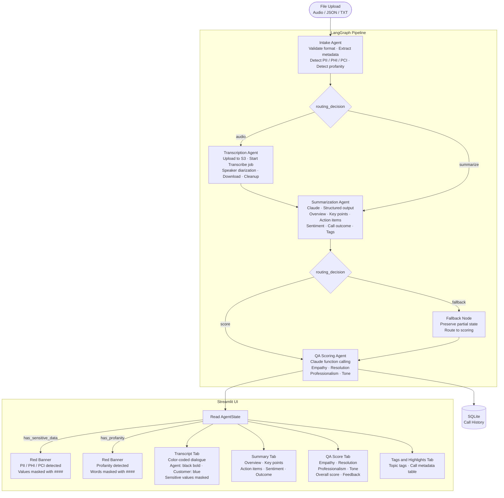

# AI Call Center Assistant

A modular multi-agent system that converts raw call recordings and transcripts into structured summaries and QA scores using LangGraph and Claude (Anthropic API or Amazon Bedrock).

## Architecture



Conditional edges in the LangGraph pipeline handle routing after each node. A transcription or summarization error routes through a fallback node so QA scoring always runs on available data.

---

## Features

- **Structured summaries** — overview, key points, action items, call outcome, sentiment
- **QA scoring** — empathy, resolution, professionalism, tone scored 0–10 with feedback
- **Sensitive data detection** — PCI (card numbers, CVV), PII (SSN, email, phone), PHI (MRN, DOB, medical info) detected at intake and after audio transcription; masked in the transcript view with partial masking where applicable (SSN shows last 4 digits as `###-##-1234`; DOB shows year only as `##/##/YYYY` or `[DOB: YYYY]`; all other values replaced with `####`); suppressed entirely from the summary; red warning banner shown in UI
- **Profanity detection** — offensive language detected, masked with `####` in the transcript view, and suppressed from the summary; sentiment still reflected accurately; red warning banner shown in UI
- **Fallback handling** — unsupported file formats are rejected immediately with a clear error message; corrupt or failed audio jobs route through the fallback node preserving partial state so QA scoring still runs
- **Call history** — all analyzed calls persisted in SQLite and shown in the sidebar with sentiment indicator and score
- **Dual LLM mode** — `USE_BEDROCK=false` uses Anthropic API directly (local dev); `USE_BEDROCK=true` uses Claude on Amazon Bedrock (AWS deployment)
- **Audio transcription** — Amazon Transcribe via S3 upload with speaker diarization (Agent / Customer turn separation); Claude fallback when no speaker labels returned
- **Number normalisation** — comma thousand-separators inserted by Amazon Transcribe (e.g. `4,421`) are stripped before display

---

## How to Test

The live deployment is accessible at:

```
https://ai-0329bd35529f43688cd951898193401d.ecs.us-east-1.on.aws
```

To test locally, clone the repo and use the sample files included in `data/sample_transcripts/`:

```bash
git clone https://github.com/raj1975/ai-call-center-assistant.git
cd ai-call-center-assistant
python -m venv .venv
source .venv/bin/activate
pip install -r requirements.txt
cp .env.example .env   # fill in ANTHROPIC_API_KEY
streamlit run ui/streamlit_app.py
```

### Recommended test scenarios

| Scenario | File to upload | What to verify |
|---|---|---|
| Clean transcript | `data/sample_transcripts/sample_call_1.json` | Summary, QA score, 4 tabs render correctly |
| PII detection | `data/sample_transcripts/sample_pii_banking.json` | Red PII banner, masked SSN/card/phone in transcript, no PII in summary |
| PHI detection | `data/sample_transcripts/sample_phi_medical.json` | Red PII banner, DOB shows year only, MRN masked |
| Profanity detection | `data/sample_transcripts/sample_profanity_pii_mixed.json` | Red profanity banner, masked words in transcript, clean summary |
| PCI detection | `data/sample_transcripts/sample_pci_card_update.json` | Card number, CVV, expiry all masked |
| Unsupported format (error path) | `data/sample_transcripts/unsupported_format.pdf` | Red error message, pipeline stops cleanly |
| Corrupt audio (fallback path) | `data/sample_transcripts/corrupt_audio.wav` | Yellow warning, fallback node fires, QA scoring still runs |
| Audio transcription | `data/sample_transcripts/sample_audio_call.mp3` | Requires AWS credentials — speaker-diarized transcript, full pipeline |

> Audio files require `AWS_ACCESS_KEY_ID`, `AWS_SECRET_ACCESS_KEY`, `AWS_REGION`, and `S3_BUCKET` set in `.env`.  
> All other file types (JSON, TXT) work with just `ANTHROPIC_API_KEY`.

---

## Unit Tests

169 tests across all modules. Run with:

```bash
pytest
```

| Test file | Coverage |
|---|---|
| `test_intake_agent.py` | Routing, metadata extraction, PII/profanity detection |
| `test_transcription_agent.py` | AWS mocks, speaker diarization, number normalisation, failure paths |
| `test_summarization_agent.py` | Routing, fallback on short/empty transcript, PII/profanity preamble injection |
| `test_quality_score_agent.py` | String-to-list coercion for strengths/improvements |
| `test_routing_agent.py` | All routing decision functions, fallback and error nodes |
| `test_sensitive_data.py` | Detection, masking, partial masking (SSN last-4, DOB year-only), context-aware masking |
| `test_validation.py` | Pydantic models |
| `test_memory.py` | SQLite persistence |
| `test_llm_factory.py` | Bedrock / Anthropic toggle |

---

## Local Setup

### Prerequisites

- Python 3.11+
- An Anthropic API key (`ANTHROPIC_API_KEY`) **or** AWS credentials with Amazon Bedrock access
- AWS credentials only needed for audio file transcription (Amazon Transcribe + S3) or Bedrock mode

### Steps

**1. Clone the repo**

```bash
git clone https://github.com/raj1975/ai-call-center-assistant.git
cd ai-call-center-assistant
```

**2. Create and activate a virtual environment**

```bash
python -m venv .venv
source .venv/bin/activate        # macOS / Linux
.venv\Scripts\activate           # Windows
```

**3. Install dependencies**

```bash
pip install -r requirements.txt
```

**4. Configure credentials**

```bash
cp .env.example .env
```

Edit `.env` and fill in:

```
# Use Anthropic API directly for local dev
USE_BEDROCK=false
ANTHROPIC_API_KEY=your_anthropic_api_key
ANTHROPIC_MODEL=claude-sonnet-4-5

# Required only for audio file uploads (Amazon Transcribe uses S3)
AWS_ACCESS_KEY_ID=your_key
AWS_SECRET_ACCESS_KEY=your_secret
AWS_REGION=us-east-1
S3_BUCKET=your-s3-bucket-name
```

**5. Run the app**

```bash
streamlit run ui/streamlit_app.py
```

Open [http://localhost:8501](http://localhost:8501) in your browser.

---

## Deploy to AWS — ECS Express (Bedrock)

The app is deployed on AWS ECS Express Service with Claude on Amazon Bedrock. The Docker image is hosted in ECR and deployed to the `default` ECS cluster using a canary deployment strategy with automatic rollback.

### Prerequisites

- AWS CLI configured (`aws configure`)
- Docker installed
- ECR repository, IAM task role, and ECS cluster already provisioned

### Build and push to ECR

```bash
aws ecr get-login-password --region us-east-1 | \
  docker login --username AWS --password-stdin 280793169196.dkr.ecr.us-east-1.amazonaws.com

docker build --platform linux/amd64 -t ai-call-center-assistant .
docker tag ai-call-center-assistant:latest \
  280793169196.dkr.ecr.us-east-1.amazonaws.com/ai-call-center-assistant:latest
docker push \
  280793169196.dkr.ecr.us-east-1.amazonaws.com/ai-call-center-assistant:latest
```

### Update the ECS service

```bash
aws ecs update-service \
  --cluster default \
  --service ai-call-center-assistant \
  --force-new-deployment \
  --region us-east-1
```

### Required environment variables in ECS task definition

| Variable | Value |
|---|---|
| `USE_BEDROCK` | `true` |
| `AWS_REGION` | `us-east-1` |
| `BEDROCK_PRIMARY_MODEL` | `us.anthropic.claude-sonnet-4-5-20250514-v1:0` |
| `S3_BUCKET` | `ai-call-center-summarization-us-east-1` |

### IAM role permissions required

```json
{
  "Version": "2012-10-17",
  "Statement": [
    {
      "Effect": "Allow",
      "Action": ["bedrock:InvokeModel", "bedrock:InvokeModelWithResponseStream"],
      "Resource": "arn:aws:bedrock:us-east-1::foundation-model/anthropic.*"
    },
    {
      "Effect": "Allow",
      "Action": ["s3:PutObject", "s3:GetObject", "s3:DeleteObject"],
      "Resource": "arn:aws:s3:::ai-call-center-summarization-us-east-1/call-audio/*"
    },
    {
      "Effect": "Allow",
      "Action": ["transcribe:StartTranscriptionJob", "transcribe:GetTranscriptionJob"],
      "Resource": "*"
    }
  ]
}
```

---

## Bedrock Model IDs

Verify available Claude model IDs at **AWS Console → Amazon Bedrock → Model access**.

Default used: `us.anthropic.claude-sonnet-4-5-20250514-v1:0`  
Override via the `BEDROCK_PRIMARY_MODEL` environment variable.

---

## Project Structure

```
├── agents/
│   ├── intake_agent.py          input validation, metadata extraction, PII/profanity detection
│   ├── transcription_agent.py   Amazon Transcribe STT, speaker diarization, number normalisation
│   ├── summarization_agent.py   LangChain + Pydantic: structured summary with PII/profanity suppression
│   ├── quality_score_agent.py   Claude function calling: QA rubric scoring
│   └── routing_agent.py         conditional routing functions and fallback/error nodes
├── graph/
│   ├── state.py                 AgentState TypedDict (single source of truth)
│   └── workflow.py              LangGraph StateGraph assembly with MemorySaver checkpointer
├── ui/
│   └── streamlit_app.py         4-tab Streamlit interface with call history sidebar
├── utils/
│   ├── llm_factory.py           Anthropic / Bedrock toggle (USE_BEDROCK env var)
│   ├── memory.py                SQLite call history persistence
│   ├── sensitive_data.py        regex-based PCI/PHI/PII detection + profanity word-list
│   ├── validation.py            Pydantic models: CallMetadata, CallSummary, QAScore
│   └── observability.py         log_agent decorator: timing, entry/exit, error logging
├── tests/
│   ├── test_intake_agent.py
│   ├── test_transcription_agent.py
│   ├── test_summarization_agent.py
│   ├── test_quality_score_agent.py
│   ├── test_routing_agent.py
│   ├── test_sensitive_data.py
│   ├── test_validation.py
│   ├── test_memory.py
│   └── test_llm_factory.py
├── data/
│   └── sample_transcripts/      22 sample files — clean calls, PII/PHI/PCI, profanity, audio,
│                                 unsupported format (PDF), and corrupt audio for fallback testing
├── .streamlit/
│   └── config.toml              theme, upload size, toolbar/top-bar settings
├── config/
│   └── mcp.yaml                 model control plane config
├── Dockerfile
├── docker-compose.yml
├── .env.example
└── requirements.txt
```

---

## Supported Input Formats

| Format | Description |
|--------|-------------|
| `.mp3`, `.wav`, `.m4a`, `.ogg` | Audio — transcribed via Amazon Transcribe |
| `.json` | Transcript with metadata: `agent_name`, `customer_name`, `duration_seconds`, `transcript` |
| `.txt` | Plain text transcript |

Unsupported formats (e.g. `.pdf`, `.docx`) are rejected at intake with a clear error message.

---

## QA Scoring Rubric

| Dimension | Weight | Description |
|-----------|--------|-------------|
| Resolution | 35% | Was the issue resolved effectively? |
| Empathy | 25% | Did the agent show genuine understanding? |
| Professionalism | 20% | Language and conduct quality |
| Tone | 20% | Warmth and appropriateness throughout |
